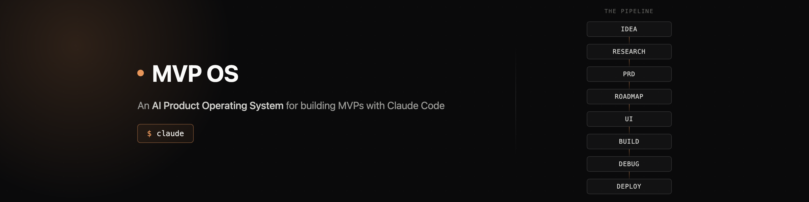

# MVP OS



**An AI Product Operating System for building MVPs with Claude Code.**

This isn't a coding course in a box — it's a repository that bundles a product management framework, a prompt library, and a full code-generation workflow into one place. Fork it, state your idea, and go.

## What's in here

- **14 Claude Skills** covering the full pipeline, from research to deploy
- **A product management framework** — Todd Birzer's 4-pillar map, which is *why* the pipeline is ordered the way it is, not an arbitrary checklist
- **A prompt library** — ready-to-use prompts per stage, copy and adapt
- **Research / PRD / UI generation** — skills adapted from [product-on-purpose/pm-skills](https://github.com/product-on-purpose/pm-skills) (Apache-2.0)
- **Three example projects** — one fully worked (Booking System), two as starting prompts (CRM, AI Chat Dashboard)
- **A deploy script** — one command to Vercel (static) or Railway (has a backend)

Clone it, and you can build your own MVP the same day.

## Repository Tour

```
mvp-os/
├── .claude/
│   └── skills/          14 skills: research, persona, competitor, lean-canvas,
│                         prd, roadmap, user-story, ui, build, frontend,
│                         backend, database, debug, deploy
├── framework/            why the pipeline is ordered this way (PM framework + prompt frameworks)
├── prompts/               ready-to-use prompts per stage — copy and go
├── template/              shortcuts to each artifact's template
├── examples/              3 example projects (1 fully worked + 2 starter prompts)
└── CLAUDE.md              tells Claude Code to follow this workflow, every time
```

## The Pipeline

```
Idea → /research → /prd → /roadmap → /ui → /build (→ /frontend /backend /database) → /debug → /deploy
```

Full rationale for the order → `framework/workflow.md`.

## Quickstart

```bash
git clone <this-repo-url> my-mvp
cd my-mvp
claude
```

Then, in the Claude Code session:

```
Build an MVP: [your idea in one sentence]
Use this repository. Follow the full workflow (research → prd → roadmap → ui → build → debug → deploy).
```

More ready-made prompts: `prompts/prompt-library.md`. A fully worked example: `examples/booking-system/`.

**Don't have Claude Code set up yet?** The planning skills (`research`, `persona`, `competitor`, `lean-canvas`, `prd`, `roadmap`, `ui`) also work directly on [claude.ai](https://claude.ai) — see `docs/USING-ON-CLAUDE-WEB.md` for how to upload them there.

## Update / Fork / Contribute

- **Fork and build:** hit Fork on GitHub, clone your copy, edit or add skills freely — nothing here affects the original.
- **Pull upstream updates:** `git remote add upstream <original-repo-url>` then `git fetch upstream && git merge upstream/main`.
- **Contribute back:** open a Pull Request on the original if you've built a skill or example worth sharing.

## License & Attribution

- This kit: MIT (except files whose own frontmatter states `license: Apache-2.0`).
- Skills `persona`, `competitor`, `lean-canvas`, `prd`, `user-story`, and the references used by `research`/`roadmap`: adapted from [product-on-purpose/pm-skills](https://github.com/product-on-purpose/pm-skills), Apache License 2.0 — see `NOTICE` and `LICENSE-pm-skills`.
- Prompt framework cheat sheet: adapted from [ckelsoe/prompt-architect](https://github.com/ckelsoe/prompt-architect), MIT.
- PM framework diagram: Todd Birzer, "The Work of Product Management."
